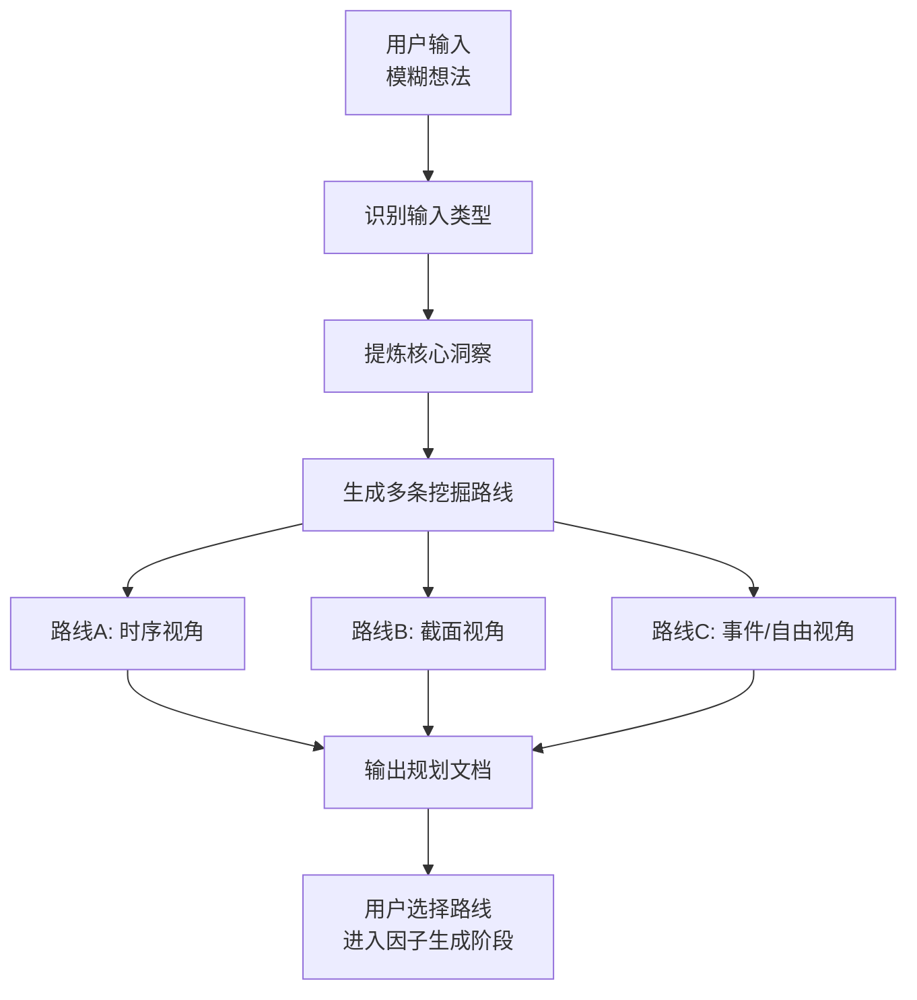

# 因子挖掘规划指南

帮助用户将模糊的交易想法转化为明确的因子挖掘方向。

## 目标用户

- **初学者**: 刚接触量化交易，需要更多指导
- **主观交易员**: 有丰富市场经验，需要将直觉系统化

## 核心流程



**核心目标**：从用户的模糊想法中，识别出**多条**可能的因子挖掘方向，供后续选择。

## ⚡ 核心原则：AST 引擎优先（硬性规则）

**Vista 提供 6 种计算引擎，但规划路线时 `compute_engine` 必须优先选择 AST 引擎（`TSA` / `CSA`），因为它们底层由 `chan_factor_rs` (Rust) 驱动，计算速度比 Python 函数引擎快一个数量级以上。**

**选择优先级**（从高到低）：

1. **首选 `TSA` / `CSA`**：只要因子逻辑可以用标准数学表达式描述（算子组合 + 常量参数），就必须使用 AST 引擎。这覆盖了 80% 以上的量价因子：动量、反转、波动率、放量、量价背离、横截面排名等。
2. **次选 `TSE` / `CSE`**：**只有**在 AST 算子库确实无法表达时才使用（例如：多步骤条件判断、外部库调用、复杂状态机、跨 symbol 自定义聚合）。
3. **`EDE`**：事件因子唯一选择，值域 {0, 1, -1}。
4. **`FRE`**：需要外部数据源（财报日历、行业分类、多数据源组合）时才用，默认超时 120s。

**强制自检**：每次生成一条 `compute_engine` 非 AST 的路线前，必须自问：
> 「这个因子真的无法用 AST 算子（SMA/EMA/STD/RANK/CORR/DELAY/DELTA/TS_MAX/IF/WHERE 等）组合表达吗？」

如果答不上来"是"，就应改用 TSA / CSA。

## Step 1: 识别输入类型

首先判断用户输入属于哪种类型：

| 输入类型 | 识别特征 | 示例 |
|---------|---------|------|
| **交易经验** | 描述操作观察 | "突破均线后经常大涨" |
| **市场现象** | 描述规律现象 | "小盘股牛市表现更好" |
| **技术指标** | 明确指标名称 | "想基于RSI做因子" |
| **事件驱动** | 描述特定事件 | "财报前波动加大" |

**引导策略**：
- 交易经验 → 提取核心条件和预期结果
- 市场现象 → 明确比较对象和适用环境
- 技术指标 → 确认指标用法和信号定义
- 事件驱动 → 定义事件窗口和反应逻辑

## Step 2: 提炼核心洞察（必问）

使用 AskUserQuestion 工具，**逐个问题**引导用户：

**问题1: 核心规律**
> "这个现象的**核心规律**是什么？请用一句话描述。"

**问题2: 有效条件**
> "什么条件下这个规律最明显？"
> - 市场环境（牛市/熊市/震荡）
> - 时间周期（短线/中线/长线）
> - 股票特征（大盘/小盘/行业）

**问题3: 获利来源**
> "你预期的**获利来源**是什么？"
> - 趋势延续（动量）
> - 均值回归（反转）
> - 信息不对称（事件）
> - 风险补偿（风险溢价）

## Step 3: 确定因子类型与计算引擎（必问）

使用 AskUserQuestion 工具，提供选项并解释。Vista 提供 **6 种计算引擎**，分属 4 种逻辑类型：

### 引擎总览（按推荐优先级排序）

| 逻辑类型 | 比较维度 | ✅ 首选（AST，高性能） | 备选（Python 函数） | 典型场景 |
|---------|---------|----------------------|--------------------|---------|
| **时序因子** | 股票自身历史 | **`TimeSeriesAstEngine` (TSA)** | `TimeSeriesEngine` (TSE) | 趋势、动量、波动率 |
| **截面因子** | 同时刻多股票 | **`CrossSectionAstEngine` (CSA)** | `CrossSectionEngine` (CSE) | 排名、估值、相对强弱 |
| **事件因子** | 特定事件点 | — | `EventDrivenEngine` (EDE) | 财报、涨跌停、公告 |
| **自由因子** | 自定义数据源 | — | `FreedomEngine` (FRE) | 需要外部数据、多数据源 |

### 引擎选择决策树

**Step 1 — 先确定逻辑类型**：
- "股票自身的..." → 时序因子
- "和其他股票比..." → 截面因子
- "当...发生时..." → 事件因子（EDE）
- "需要获取额外数据..." → 自由因子（FRE）

**Step 2 — 时序/截面必须默认 AST**：
- 时序 → 先尝试 `TSA`，只有当表达式引擎无法表达时才降级到 `TSE`
- 截面 → 先尝试 `CSA`，只有当表达式引擎无法表达时才降级到 `CSE`

**AST 引擎的本质特点**：
- `factor_code` 是**字符串表达式**（如 `RANK(CLOSE / DELAY(CLOSE, 20) - 1)`）
- 由 `chan_factor_rs` (Rust) 单次批量执行，全市场并行计算
- 支持 60+ 算子（算术、统计、时序、横截面、条件），覆盖绝大多数量价因子
- 具体算子清单与语法：见 `vista-ast-factor` skill

**Python 函数引擎何时才用**：
- 需要 `if/else` 复杂分支控制
- 需要调用 `talib` / `scipy` / `sklearn` 等外部库
- 需要多步骤中间状态（状态机、递归逻辑）
- 需要跨 symbol 的自定义聚合或 join

### 各引擎特性对比

| 引擎 | 枚举值 | 数据输入 | 因子代码形式 | 计算粒度 | 默认超时 | 相对性能 | 适用场景 |
|------|--------|---------|-------------|---------|---------|---------|---------|
| **TimeSeriesAstEngine** | `TSA` | `data["klines"]` | AST 表达式 | chan_factor_rs 单次调用 | 30s | ⚡⚡⚡ 最快 | 标准时序表达式（首选） |
| **CrossSectionAstEngine** | `CSA` | `data["klines"]` | AST 表达式 | chan_factor_rs 单次调用 | 30s | ⚡⚡⚡ 最快 | 标准截面表达式（首选） |
| TimeSeriesEngine | `TSE` | `data["klines"]` | Python 函数 | 逐品种迭代 | 30s | ⚡ | 复杂时序逻辑（降级备选） |
| CrossSectionEngine | `CSE` | `data["klines"]` | Python 函数 | 全量数据单次调用 | 30s | ⚡ | 复杂截面逻辑（降级备选） |
| EventDrivenEngine | `EDE` | `data["klines"]` | Python 函数 | 逐品种（继承 TSE） | 30s | ⚡ | 事件信号（值域 {0,1,-1}）|
| FreedomEngine | `FRE` | `data` 可选 | Python 函数（无参数） | 函数内部自行获取数据 | 120s | ⚡ | 多数据源、外部数据 |

> **注意**：AST 引擎 (TSA/CSA) 的结果列名通过 `tag` 参数控制，默认为 `F#{factor_name}#AST`；NaN 填充值通过 `fill_na_value` 参数控制，默认为 `0`。

## Step 4: 确定数据需求

根据因子类型，引导用户选择数据字段：

### 标准K线字段（TSE/CSE/EDE/TSA/CSA 通用）

| 字段 | 说明 | 典型用途 |
|------|------|---------|
| `close` | 收盘价 | 价格形态、收益率 |
| `high/low` | 最高/最低价 | 波动率、突破 |
| `vol` | 成交量 | 量价关系 |
| `amount` | 成交额 | 资金流向 |

> AST 引擎使用 `$` 前缀引用字段：`$close, $open, $high, $low, $vol, $amount`

### 截面因子额外字段

| 字段 | 说明 | 典型用途 |
|------|------|---------|
| `market_cap` | 市值 | 规模因子、中性化 |
| `industry` | 行业分类 | 行业中性化 |
| `pe_ratio` | 市盈率 | 估值因子 |

### 自由因子数据源（FRE 专用）

FreedomEngine 不依赖预传入的 klines，函数内部通过以下 API 自行获取数据：

**vista.data.ts** — TuShare 数据接口：
- `get_klines(ts_code, asset_type, start_date, end_date, freq, adj, ...)` — 综合K线获取
- `get_realtime_snapshot(ts_code, asset_type, freq)` — 实时最新分钟线
- 支持：股票、ETF、可转债、期货、期权、指数、港股、美股

**vista.data.xy** — XY 内部数据接口：
- `get_symbols(name, ...)` — 品种列表（"期货主力"、南华指数等）
- `get_future_klines(symbol, freq, sdt, edt, ...)` — 期货日线/分钟线

**vista.data.cooperation** — CZSC 团队协作数据：
- `get_symbols(name, ...)` — 品种列表（"A股指数"、"ETF"、"股票"、"期货主力"等）
- `get_raw_bars(symbol, freq, sdt, edt, ...)` — 标准 RawBar 对象
- `stocks_daily_klines(sdt, edt, ...)` — 全市场A股日线（磁盘缓存）

### 数据频率选择

| 频率 | 适用场景 |
|------|---------|
| 日频 | 中长期策略 |
| 分钟频 | 日内策略 |
| 周频/月频 | 宏观策略 |

## Step 5: 绑定计算引擎

根据因子类型自动确定（**按 AST 优先排序**）：

| 因子类型 | 推荐引擎 | 枚举值 | 优先级 | 备注 |
|---------|---------|--------|--------|------|
| 时序因子 | **TimeSeriesAstEngine** | `ComputeEngine.TSA` | ⭐ 首选 | Rust 驱动，高性能 |
| 时序因子 | TimeSeriesEngine | `ComputeEngine.TSE` | 降级 | AST 无法表达时才用 |
| 截面因子 | **CrossSectionAstEngine** | `ComputeEngine.CSA` | ⭐ 首选 | Rust 驱动，高性能 |
| 截面因子 | CrossSectionEngine | `ComputeEngine.CSE` | 降级 | AST 无法表达时才用 |
| 事件因子 | EventDrivenEngine | `ComputeEngine.EDE` | 唯一选择 | — |
| 自由因子 | FreedomEngine | `ComputeEngine.FRE` | 唯一选择 | 需要外部数据源 |

## 路线独立性约束（硬性要求）

**同一次输出的任意两条 FactorRoute 之间必须有充分的逻辑独立性**：

- ❌ 不允许仅通过参数差异堆砌（如「20日均线」和「30日均线」同为时序动量路线）
- ❌ 不允许核心思路基本相同（如同是量价动量，只换了引擎实现）
- ✅ 至少跨越一个维度差异：逻辑类型（时序/截面/事件）、市场机制、数据视角
- 生成结束前，自我审查 routes[i] vs routes[j] 是否过于相似；相似即合并或替换其中一条

该约束由 **FactorPlanAgent** 的 `_ensure_independence` 流程在生成后再由 LLM 复核，
但规划阶段主动满足能显著降低二次剔除率。

## 输出规划文档

完成所有问题后，输出结构化的 `FactorRoute` 对象列表。

### FactorRoute 对象

每条挖掘路线必须构造为 `vista.factor_db.models.FactorRoute` 对象，强制要求经济学逻辑：

```python
from vista.factor_db.models import FactorRoute, MarketMechanism
from vista.factor_db.enums import ComputeEngine

route = FactorRoute(
    name="量价动量时序因子",                      # 路线名称
    compute_engine=ComputeEngine.TSA,             # 计算引擎
    key_inspect="放量上涨后资金持续流入，动量在短期内倾向延续",  # ≤100字核心思路
    economic_logic="成交量是资金意愿的直接体现，量价齐升表明买方力量强劲",
    why_effective="信息不对称导致资金分批入场，产生可观测的趋势延续信号",
    market_mechanism=MarketMechanism.BEHAVIORAL_BIAS,  # 主导市场机制
    failure_scenarios=[                           # 至少1个失效场景
        "极端行情下流动性消失，量价信号失真",
        "政策突发冲击下趋势急速反转",
    ],
    tags=["动量", "时序", "量价"],                # 可选分类标签
)
```

**必填字段说明**：

| 字段 | 约束 | 作用 |
|------|------|------|
| `name` | — | 人类可读标识 |
| `compute_engine` | `ComputeEngine` 枚举 | 确定数据访问方式 |
| `key_inspect` | ≤100 字 | 一句话核心思路，LLM 生成代码的核心输入 |
| `economic_logic` | — | 防止纯数据挖掘过拟合 |
| `why_effective` | — | 解释因子预测能力来源 |
| `market_mechanism` | `MarketMechanism` 枚举 | 分类管理，便于批量分析 |
| `failure_scenarios` | ≥1 项 | 主动识别风险 |

**MarketMechanism 枚举**：
- `MISPRICING` — 错误定价
- `RISK_PREMIUM` — 风险补偿
- `BEHAVIORAL_BIAS` — 行为偏差
- `LIQUIDITY_PREMIUM` — 流动性溢价
- `INSTITUTIONAL_ARBITRAGE` — 制度性套利

> **数据需求**：不需要单独指定，通过 `compute_engine` 对应引擎的 `data_describe` 属性自动获取。

### 输出规划文档

同时生成 `factor_planning.md` 文件，供人类阅读：

**核心原则**：
- **探索性规划**：不追求精确定义，而是指明方向
- **多条路线**：提供多个可选的因子挖掘路径
- **保持开放**：记录模糊点，便于后续迭代

```markdown
# 因子挖掘规划文档

## 基本信息
- **规划日期**: {YYYY-MM-DD}
- **规划者**: {用户标识}

## 1. 核心洞察

### 原始想法
> {用户的原始输入}

### 核心规律（一句话）
{提炼后的核心投资逻辑，不超过50字}

### 投资假设
- **有效条件**: {什么条件下这个规律有效}
- **获利来源**: {趋势延续/均值回归/信息不对称/风险补偿}

## 2. 挖掘路线（重点）

> 根据核心洞察，识别出多条可能的因子挖掘方向

### 路线 A: {路线名称}
- **计算引擎**: {TSE/TSA/CSE/CSA/EDE/FRE}
- **核心思路**: {简述，≤100字}
- **经济学逻辑**: {为什么市场中存在这个信号}
- **市场机制**: {错误定价/风险补偿/行为偏差/流动性溢价/制度性套利}
- **失效场景**: {什么条件下失效}

### 路线 B: ...
### 路线 C: ...（可选）

## 3. 待明确问题

- [ ] {模糊点1}
- [ ] {模糊点2}

## 4. 下一步建议

- [ ] **推荐使用 CLI**（两步走）：
  - `vista factor plan "<原始想法>" -o ./factor_plans` → 生成 TOML 规划文件
  - `vista factor build ./factor_plans/<timestamp>.toml --factor-numbers 20` → 根据 route 批量挖掘因子
- [ ] **Python API**：`FactorBuilder(route, db_path="./factors.duckdb", factor_numbers=20).run()` 按单条 route 挖掘
- [ ] 继续深入探讨待明确的问题
- [ ] 使用 **single-factor-review** 评估生成的因子

---
*文档由 vista-factor-planning skill 生成*
```

## 多路线生成指南

**关键**：从用户的想法中识别多个可能的因子方向，每条路线绑定对应的计算引擎。**默认首选 TSA / CSA**，仅在 AST 算子无法表达时才退回 TSE / CSE。

### 示例：用户说"放量突破后经常涨"

| 路线 | 类型 | 引擎 | 核心思路 |
|------|------|------|---------|
| A. 量价动量 | 时序 | **TSA** | 放量程度作为动量信号（AST 可表达） |
| B. 价格突破 | 时序 | **TSA** | 创新高作为趋势信号（AST 可表达） |
| C. 量价协同 | 时序 | **TSA** | 放量 AND 突破的组合信号（`IF/WHERE` 算子可表达） |
| D. 相对强度 | 截面 | **CSA** | 放量程度横截面排名（AST `RANK` 可表达） |

### 示例："小盘股涨得快"

| 路线 | 类型 | 引擎 | 核心思路 |
|------|------|------|---------|
| A. 规模因子 | 截面 | **CSA** | 市值排名选小盘 |
| B. 规模动量 | 截面 | **CSA** | 小盘股的动量效应 |
| C. 流动性溢价 | 截面 | CSE | 小盘股流动性风险补偿（涉及多步骤统计，AST 难表达时才用） |

### 示例："财报前波动加大"

| 路线 | 类型 | 引擎 | 核心思路 |
|------|------|------|---------|
| A. 波动率时序 | 时序 | **TSA** | 财报前 N 日波动率变化（AST `STD/DELAY` 可表达） |
| B. 事件信号 | 事件 | EDE | 财报发布前做多波动（事件引擎唯一选择） |
| C. 自由数据 | 自由 | FRE | 结合外部财报日历数据（需外部数据） |

### 路线生成技巧

1. **拆解维度**：将用户想法拆成多个可独立探索的维度
2. **类型转换**：同一个想法可以有时序、截面、事件多种实现
3. **引擎选择（硬性）**：**默认 TSA / CSA**；仅当复杂控制流、外部库、多步状态时才用 TSE / CSE
4. **参数差异不算独立路线**：不同窗口（20 vs 30）同属一条路线，必须换核心逻辑
5. **组合视角**：单独因子 vs 组合因子

## 常见问题

### Q: 如何区分时序因子和截面因子？

**判断口诀**：
- "自己跟自己比" → 时序因子
- "跟别人比" → 截面因子

**例子**：
- "股价突破60日均线" → 时序（自己现在的价格 vs 自己过去的价格）
- "市值最小的10%股票" → 截面（这只股票 vs 其他股票）

### Q: 什么时候用 AST 引擎，什么时候用 Python 函数引擎？

**默认 AST**。只要能用表达式写出来，就一定用 AST（性能快一个数量级以上）。

- **AST 引擎** (TSA/CSA)：因子可以用标准数学表达式描述（算子组合 + 常量参数），表达式由 `chan_factor_rs` (Rust) 批量并行执行。覆盖 80%+ 的量价因子场景。
- **Python 函数引擎** (TSE/CSE)：**只有**当 AST 算子清单无法表达时才降级使用 —— 例如需要复杂控制流、调用 `talib`/`scipy`/`sklearn`、跨 symbol 自定义聚合等。

> 判断标准：先查 `vista-ast-factor` skill 的算子清单，能拼出来就用 AST。

### Q: 什么时候用 FreedomEngine？

- 需要外部数据源（如财报日历、行业分类）
- 需要多数据源组合（股票+期货、A股+港股等）
- 因子函数需要自行决定获取什么数据
- 注意：FRE 默认超时 120s（其他引擎 30s），因为涉及外部数据获取

### Q: 用户的想法很模糊怎么办？

**引导技巧**：
1. 先让用户举一个具体的例子
2. 问"你觉得什么情况下这个规律不成立？"
3. 问"如果让你用这个规律赚钱，你会怎么操作？"

### Q: 如何判断一个想法是否值得做成因子？

**评估标准**：
1. **可量化**：能否用数学表达？
2. **可回测**：是否有历史数据？
3. **有逻辑**：是否有经济学解释？
4. **非显而易见**：是否不是所有人都知道？

## 与 FactorBuilder / CLI 的集成

规划完成后，将 `FactorRoute` 列表交给下游挖掘。**现在的 FactorBuilder 按单条 route 实例化并调用 `.run()`，不再提供 `generate_batch(routes)` 批量接口**。

### 方案 A：CLI（推荐）

```bash
# 1. 规划（产出 TOML，内含 routes 列表）
vista factor plan "放量突破60日均线后经常大涨" -o ./factor_plans

# 2. 批量挖掘（CLI 内部会遍历 routes，每条 route 启一个 FactorBuilder）
vista factor build ./factor_plans/20260417_120000.toml \
    --factor-numbers 20 --batch-size 5 --max-workers 4
```

### 方案 B：Python API（按单条 route 循环）

```python
from vista.agents.factor_builder import FactorBuilder
from vista.agents.factor_plan import plan_factor_routes

# 规划
result = plan_factor_routes(
    "放量突破60日均线后经常大涨",
    interactive=False,
    output_dir="./factor_plans",
)

# 挖掘：对每条 route 单独实例化 FactorBuilder
all_factors = []
for route in result.routes:
    builder = FactorBuilder(
        route=route,
        db_path="./factors.duckdb",
        factor_numbers=20,     # 该 route 期望挖掘的因子数
        batch_size=5,          # 单次 LLM 请求生成数
        max_workers=1,         # >1 时启用多进程
        multi_turn=False,      # True 时复用会话让 LLM 做互补挖掘
        verbose=False,
    )
    all_factors.extend(builder.run())  # list[FactorDescribe]
```

### FactorBuilder 按 compute_engine 自动分发

- **TSA / CSA** → AST 路径：LLM 生成 `factor_code` 字符串，`chan_factor_rs` 试跑验证后写入 DuckDB
- **TSE / CSE / EDE / FRE** → Python 函数路径：LLM 生成 Python 函数源码，写入 DuckDB

### 关键参数说明

| 参数 | 默认 | 含义 |
|------|------|------|
| `route` | 必填 | 单条 FactorRoute（不是 list） |
| `db_path` | `./factors.duckdb` | route + factor 统一写入的 DuckDB 路径 |
| `factor_numbers` | 1000 | 该 route 期望挖掘的因子数 |
| `batch_size` | 5 | 单次 LLM 请求生成的因子数 |
| `max_workers` | 1 | 并行进程数（>1 时跨进程拆分 factor_numbers） |
| `multi_turn` | False | 复用单一 ClaudeAgent 会话做互补挖掘 |

## 相关 Skills

| Skill | 用途 |
|-------|------|
| vista-python-factor | 生成 Python 函数因子代码（TSE/CSE/EDE/FRE 引擎） |
| vista-ast-factor | 生成 AST 因子表达式（TSA/CSA 引擎，chan_factor_rs） |
| single-factor-review | 评估已生成的因子 |
| vista-tutorial | 学习 Vista 系统使用 |
