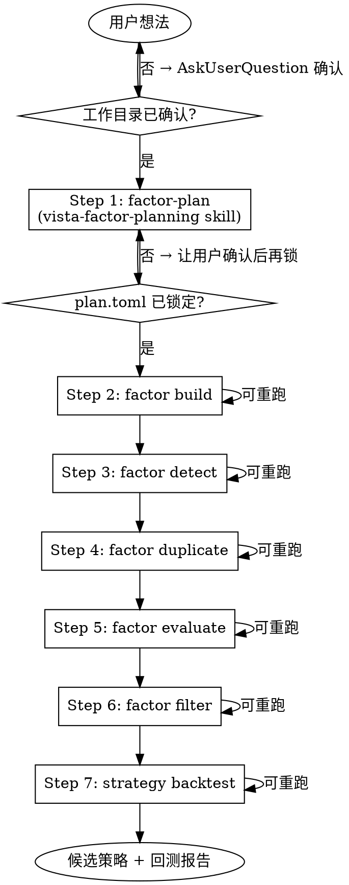

# Vista 因子投研完整流程

把用户的交易想法一口气推进到可回测的候选策略。**7 个节点 × 1 个工作目录 × 1 份不可变 plan**。

## 工作目录约定（硬性）

单个 plan 的所有产物放在**同一个目录**下。推荐结构：

```
<research_dir>/                # 用户确认后的工作目录
├── plan.toml                  # Step 1 产物；确认后不可改
├── factors.duckdb             # Step 2 产物；后续每步都读写它
├── detect/                    # Step 3 日志
│   └── run_<timestamp>.log
├── duplicate/                 # Step 4 日志
│   └── run_<timestamp>.log
├── evaluate/                  # Step 5 日志
│   └── run_<timestamp>.log
├── filter/                    # Step 6 产物（候选策略 TOML）
│   └── <problem>/<route>/<strategy>.toml
├── backtest/                  # Step 7 产物
│   └── <strategy_name>/       # 每个策略独立子目录
│       ├── weights.feather
│       ├── report.html
│       ├── metrics.json
│       └── ...
└── README.md                  # 进度追踪（每步更新）
```

**目录命名建议**：`./research/<yyyymmdd>_<主题关键词>/`，例如 `./research/20260421_vol_momentum/`。

## 流程图（决策分支）



## Step 0：确认工作目录（用户交互）

**在任何命令执行前必做**：

1. 如果用户明确给出目录 → 直接使用；
2. 如果未给出 → 用 `AskUserQuestion` 让用户确认，**必须先给出建议**。建议命名规则：`./research/<yyyymmdd>_<关键词>/`（日期取自用户想法落地当天）。

确认后：
- `mkdir -p <research_dir>`
- 如目录已存在且非空 → 警告并询问是覆盖还是换目录（避免误伤前次 plan 产物）。

## Step 1：factor-plan（交互式规划）

**调用 `vista-factor-planning` skill** 完成全部交互，将用户想法拆解为 FactorRoute 列表。不要自己写 plan 逻辑。

规划完成后：

```bash
vista factor plan "<原始想法>" --output-dir <research_dir> --as-json
```

规划文件会写入 `<research_dir>/<timestamp>.toml`；立刻重命名为固定名：

```bash
mv <research_dir>/<timestamp>.toml <research_dir>/plan.toml
```

**锁定 plan（硬性要求）**：
- 生成后向用户展示 routes 摘要，用 `AskUserQuestion` 获得「确认 / 修改 / 放弃」三选一；
- 确认后**不允许**再修改 `plan.toml`。后续任何阶段如需调整，必须新建研究目录重新 plan；
- 建议把 `plan.toml` 设为只读：`chmod 444 <research_dir>/plan.toml`（Unix）或提示用户不要编辑。

## Step 2：factor build（批量挖掘）

基于 plan.toml 的 routes 生成因子并写入 `factors.duckdb`。**后台执行**（耗时可能数十分钟）。

```bash
vista factor build <research_dir>/plan.toml \
    --factor-numbers 20 --batch-size 5 --max-workers 4 \
    --db-path <research_dir>/factors.duckdb \
    --as-json
```

**可重跑**：再次执行会继续往同一 `factors.duckdb` 追加。

## Step 3：factor detect（体检）

未来信息 / 逐品种方差 / 滚动一致性三项检查，失败的因子被软删。**后台执行**。

```bash
vista factor detect \
    --db-path <research_dir>/factors.duckdb \
    --max-workers 8 --verbose --as-json
```

幂等：已打 `detect_passed` 的因子跳过。

## Step 4：factor duplicate（去冗余）

基于 `wbt.WeightBacktest` 日收益相关性，贪心淘汰高相关因子。**后台执行**。

```bash
vista factor duplicate \
    --route <ROUTE_CODE_1> --route <ROUTE_CODE_2> \
    --problem <PROBLEM_CODE> \
    --threshold 0.8 --max-workers 8 --verbose \
    --db-path <research_dir>/factors.duckdb --as-json
```

路线 code 从 plan.toml 或 `vista factor route ls` 获取。

## Step 5：factor evaluate（多 problem × 多模型验证）

**后台执行**（常见耗时十几分钟 ~ 数小时）。

```bash
vista factor evaluate \
    --route <ROUTE_CODE> \
    --problem <PROBLEM_CODE> \
    --max-workers 8 --verbose \
    --db-path <research_dir>/factors.duckdb --as-json
```

- 不传 `--models` → 跑 6 个内置 ModelConfig；
- TSA/TSE 因子建议 `--models MA001`；CSA/CSE 因子用默认 5 个截面模型；
- 断点续传：已 SUCCESS 的 (factor, problem, method) 自动跳过；失败的加 `--retry-failed` 重试。

## Step 6：factor filter（候选策略生成）

从评估结果中筛选出可构建策略的因子组合，产出 realtime 策略 TOML。**后台执行**（即使很快也统一后台）。

```bash
vista factor filter \
    --output-dir <research_dir>/filter \
    --n 20 \
    --db-path <research_dir>/factors.duckdb --as-json
```

产物：`<research_dir>/filter/<problem>/<route>/<strategy>.toml`。

## Step 7：strategy backtest（深度分析）

对每个候选策略 TOML 执行完整回测 + HTML 报告。**后台执行**（单策略几秒 ~ 几十秒，批量亦后台提交）。

```bash
vista strategy backtest <research_dir>/filter/<problem>/<route>/<strategy>.toml \
    --mode research -o <research_dir>/backtest \
    --data-mode total --verbose --as-json
```

- `--mode research`：用研究数据（默认，没有锁）；
- `--mode realtime`：用实盘数据（有三重锁，改了 TOML 才允许重跑）；
- 批量执行：对 `filter/` 下所有 TOML 循环调用（可用 shell for 循环或并行）。

## 后台执行（硬性规则）

**所有 `vista ...` CLI 调用必须走 `Bash(run_in_background: true)`**，不允许同步阻塞等待。

### 标准流程

1. **发起**：用 `Bash` 工具调用命令，参数 `run_in_background: true`，拿到 `task_id`；
2. **告知用户**：「已在后台运行，命令耗时 ~X 分钟，完成后会收到通知」；
3. **中间不要轮询**：系统会在任务完成时自动推送 `<task-notification>`；禁止用 `sleep` / 重复 `TaskOutput` 主动查询；
4. **完成后**：用 `TaskOutput(task_id, block=false)` 或 `Read` 读取输出文件，解析 `--as-json` 的结果；
5. **失败处理**：若 JSON 含 `"ok": false` 或进程退出非零，读取 stderr，汇报错误并请示用户下一步。

### 典型耗时（供告知用户）

| 步骤 | 量级 |
|------|------|
| Step 2 factor build | 数分钟 ~ 数十分钟（视 `factor-numbers` 与 `max-workers`） |
| Step 3 factor detect | 数十秒 ~ 数分钟 |
| Step 4 factor duplicate | 数分钟（每个 problem 都要回测日收益） |
| Step 5 factor evaluate | 十几分钟 ~ 数小时（因子 × 模型 × 训练段） |
| Step 6 factor filter | 几秒 ~ 十几秒（仅查询 + 写 TOML） |
| Step 7 strategy backtest | 单策略几秒 ~ 几十秒；批量顺序跑 |

### 反模式

- ❌ `run_in_background: false` 同步等待 → 会阻塞后续任何工具调用；
- ❌ `&` 手动放到 shell 后台 → 丢失 `task_id`，无法后续读取；
- ❌ `sleep 60 && TaskOutput` 轮询 → 浪费上下文；
- ❌ 收到通知前主动 `TaskOutput(block=true)` → 和同步等待等价。


| 场景 | 动作 |
|------|------|
| 同一 plan 想多挖些因子 | 重跑 Step 2，`--factor-numbers` 调大 |
| 调整体检阈值 | 改参数后重跑 Step 3（已打 tag 的因子会跳过，先清 tag 再跑） |
| 更改去冗余阈值 | 重跑 Step 4，前一轮软删的因子保持软删 |
| 换 problem / 换 model | 重跑 Step 5，断点续传 |
| 调整初/精筛参数 | 重跑 Step 6（会重写 filter/ 目录） |
| 深入回测某策略 | 单独 Step 7 某个 TOML |

## 与用户的交互检查点

| 节点 | 必须交互 | 方式 |
|------|----------|------|
| Step 0 | 确认工作目录 | AskUserQuestion（先给建议） |
| Step 1 | 规划交互 | 委派 `vista-factor-planning` skill |
| Step 1 末 | 确认 routes 锁定 | AskUserQuestion（确认/修改/放弃） |
| Step 2~7 | 失败时 | 汇报错误，请示下一步 |

## 进度追踪（README.md 模板）

每完成一步更新 `<research_dir>/README.md`：

```markdown
# 研究目录：<关键词>

- **创建日期**: 2026-04-21
- **原始想法**: <用户原话>
- **plan.toml 状态**: 已锁定 ✅

## 进度

| 步骤 | 状态 | 时间 | 备注 |
|------|------|------|------|
| 1. factor-plan | ✅ | 2026-04-21 10:00 | 生成 3 条 routes |
| 2. factor build | ✅ | 2026-04-21 10:30 | 生成 60 个因子 |
| 3. factor detect | ✅ | 2026-04-21 11:00 | 45 通过 / 15 软删 |
| 4. factor duplicate | ✅ | ... | ... |
| 5. factor evaluate | ⏳ | 进行中 | ... |
| 6. factor filter | ⏸️ | 待执行 | ... |
| 7. strategy backtest | ⏸️ | 待执行 | ... |
```

## 红线约束（必须遵守）

1. **plan.toml 一旦确认，绝不修改**。需要改动 → 新建目录重新 plan；
2. **所有产物必须写入同一 `<research_dir>`**，禁止散落到其他路径；
3. **每个 CLI 调用都带 `--db-path <research_dir>/factors.duckdb`**，避免误写到默认库（`~/.vista/factor.duckdb`）；
4. **每步都用 `--as-json`**（LLM 解析友好）；
5. **Step 0 的目录确认不可跳过**，即使用户催促也必须先让其确认；
6. **所有 vista CLI 调用必须使用 `run_in_background: true`**（后台执行）。这些命令耗时从几十秒到几十分钟不等，后台执行可避免阻塞会话。发起后告知用户「已在后台运行，完成后会通知」，继续处理其他交互（如更新 README 进度）；收到完成通知后再用 `TaskOutput` / `Read` 解析输出并汇报结果。

## 常见问题

### Q：用户没给目录怎么办？

先调 `AskUserQuestion`，提供 2-3 个命名建议（例如 `./research/20260421_<主题>/`），让用户选。

### Q：plan.toml 已经跑过一轮，用户想再加一条 route？

**禁止**在原目录改 plan.toml。正确做法：新建 `<research_dir>_v2/`，把原 plan.toml 复制过去后再 `vista factor plan` 追加，或直接重新规划。

### Q：Step 4 要哪些 routes / problems？

从 `plan.toml` 读取；用户如果没指定 problem，默认用 plan 中首条 route 适配的 problem（可先 `vista factor route ls --as-json` 查）。

### Q：Step 7 批量回测所有策略怎么并行？

单条 TOML 用 `--n-jobs` 控制 wbt 内部并行即可；策略之间串行就好（一个策略往往只要几秒到几十秒）。

## 相关 skills

| Skill | 节点 | 用途 |
|-------|------|------|
| `vista-factor-planning` | Step 1 | 与用户交互拆解 routes |
| `vista-cli` | Step 2~7 | 查命令参数与字段 |
| `vista-ast-factor` / `vista-python-factor` | Step 2 | FactorBuilder 内部已自动分派，通常无需手动介入 |
